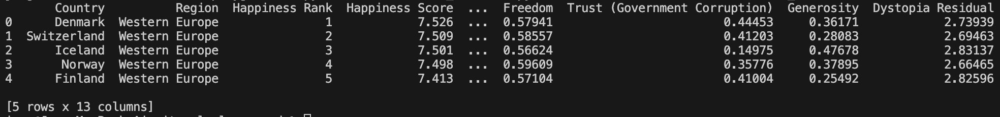

# ✨ Welcome to Section 1 Tutorial ✨

## 📫 Download Your Dataset

Please run following command from your terminal/command prompt in curent repository directory to download dataset needed:

```shell
python3 section1/run_section1.py --mode download
```

If dataset successfully downloaded, your dataset will be appear in dataset folder with file name `whr_dataset.csv`

## 📈 Dataset Exploration

<details>
<Summary> Show Current Dataset </Summary>

Please run this command below:

```shell
python3 section1/run_section1.py --mode show --dataset ./dataset/whr_dataset.csv
```

The output from this command will be like this:



</details>

<details>
<Summary>Sort Dataset Based on Ascending/Descending</Summary>

Please run this command below to sort in Ascending order:

```shell
python3 section1/run_section1.py --mode sort --dataset ./dataset/whr_dataset.csv --type_sort asc --column Country
```

For Descending order please run this command:

```shell
python3 section1/run_section1.py --mode sort --dataset ./dataset/whr_dataset.csv --type_sort desc --column Country
```

**💡 Tips: you can change which column you want to sort. Make sure that column exist in dataset!!**

</details>

## 📁 Dataset Explanation

There are 2 datasets used in this repository namely **World Happiness Report Dataset (for classification)** and **Shop Customer Data (for clustering)**:

- This repository uses World Happiness Report Dataset from [Kaggle Website Classification](https://www.kaggle.com/datasets/unsdsn/world-happiness?resource=download&select=2016.csv). This dataset contains 13 columns to described the world happiness report based on several parameters for 157 rows. This columns are represented as belows:
  - Country
  - Region
  - Happiness Rank
  - Happiness Score
  - Lower Confidence Interval
  - Upper Confidence Interval
  - Economy (GDP per Capita)
  - Family
  - Health (Life Expectancy)
  - Freedom
  - Trust (Government Corruption)
  - Generosity
  - Dystopia Residual
- This repository also uses Shop Customer Dataset from [Kaggle Website Clustering](https://www.kaggle.com/datasets/datascientistanna/customers-dataset). This dataset contains 8 columns to describe customer data who visits the shop with 2000 rows in total. This columns are represented as belows:
  - CustomerID
  - Gender
  - Age
  - Annual Income ($)
  - Spending Score (1-100)
  - Profession
  - Work Experience
  - Family Size

## 📚 Libraries Used in This Repository

- Numpy: library for multidimensional array and matrices processing.
- Pandas: library for data manipulation, reading data, and data analysis.
- Matplotlib: library for data plotting and data visualization.
- Seaborn: based on Matplotlib with more advanced features to visualize your data.
