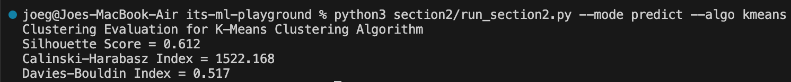
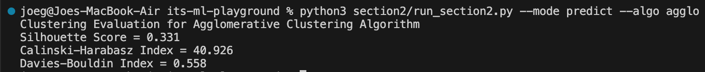
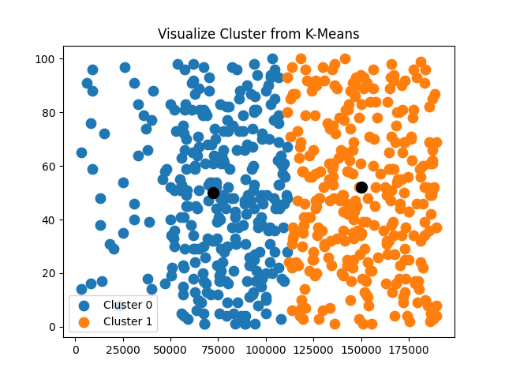
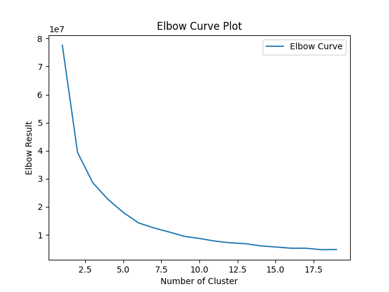
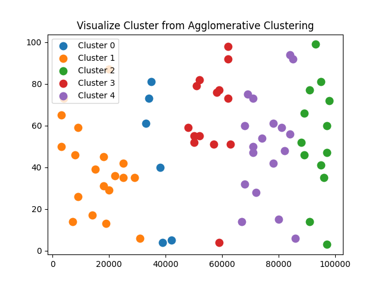

# ✨ Welcome to Section 2: Unsupervised Learning (Clustering) Tutorial ✨

## 📋 Train & Predict Dataset

<details><summary>K-Means Clustering</summary>

To train and predict dataset using KMeans clustering, you need to run command below:

```bash
python3 section2/run_section2.py --algo kmeans --mode predict
# or
python section2/run_section2.py --algo kmeans --mode predict
```

This command accept following arguments:

- `--mode` : You can choose between `predict` for training and prediction and `vis` for visualization. **This argument is necessary**
- `--algo` : Name of algorithm used (you can choose between `kmeans` for KMeans Clustering or `agglo` for Hierarchical Clustering). **This argument is necessary**
- `--n_cluster` : Number of cluster used in algorithm. Default value is **2**
- `--iter` : Number of iteration used in KMeans. Default value is **300**
- `--dist_metric` : Distance measurement method. You can choose between `euclid` for using [Euclidean Distance](https://en.wikipedia.org/wiki/Euclidean_distance), `manhattan` for using [Manhattan Distance](https://en.wikipedia.org/wiki/Taxicab_geometry), or `minkowski` for using [Minkowski Distance](https://en.wikipedia.org/wiki/Minkowski_distance). Default value is **euclid**
- `--p` : P value for Minkowski Distance. Default value is **3**

Running above command will produce clustering evaluation metrics score result using Silhouette Score, Calinski-Harabasz Index, and Davies-Bouldin Index like this screenshot.



*Another Approach: If using Scikit-Learn library, training & prediction with K-Means Clustering will be done by using following code:*

```python
from sklearn.cluster import KMeans
kmeans = KMeans(n_clusters=2)
kmeans.fit(x_train)
kmeans.predict(x_test)
```

</details>

<details><summary>Hierarchical Clustering</summary>

To train and predict dataset using Hierarchical Clustering, you need to run command below:

```bash
python3 section2/run_section2.py --algo agglo --mode predict
# or
python section2/run_section2.py --algo agglo --mode predict
```

This command accept following arguments:

- `--mode` : You can choose between `predict` for training and prediction and `vis` for visualization. **This argument is necessary**
- `--algo` : Name of algorithm used (you can choose between `kmeans` for KMeans Clustering or `agglo` for Hierarchical Clustering). **This argument is necessary**
- `--n_cluster` : Number of cluster used in algorithm. Default value is **2**
- `--linkage` : Linkage type for Hierarchical Clustering. YOu can choose between `complete` or `single`. Default value is **complete**
- `--data_limit` : Number of rows used in training, this argument exist due to computational complexity of Hierarchical Clustering in large dataset. Default value is **70**
- `--dist_metric` : Distance measurement method. You can choose between `euclid` for using [Euclidean Distance](https://en.wikipedia.org/wiki/Euclidean_distance), `manhattan` for using [Manhattan Distance](https://en.wikipedia.org/wiki/Taxicab_geometry), or `minkowski` for using [Minkowski Distance](https://en.wikipedia.org/wiki/Minkowski_distance). Default value is **euclid**
- `--p` : P value for Minkowski Distance. Default value is **3**

Running above command will produce clustering evaluation metrics score result using Silhouette Score, Calinski-Harabasz Index, and Davies-Bouldin Index like this screenshot.



*Another Approach: If using Scikit-Learn library, training & prediction with Hierarchical Clustering will be done by using following code:*

```python
from sklearn.cluster import AgglomerativeClustering
agglo = AgglomerativeClustering().fit(x_train)
# or
agglo = AgglomerativeClustering().fit_predict(x_train)
```

</details>

## 🔬 Evaluation Metrics

This code repository used 3 metrics for measuring the robustness of each algorithm in chosen dataset:

- Silhouette Score : Metric used to measure the quality of clustering result ranging from -1 to 1, higher score indicate a better clustering result. For detail explanation you can visit [Silhouette Score Explanation](https://en.wikipedia.org/wiki/Silhouette_(clustering)).
- Calinski - Harabasz Index : also known as Variance Ratio Criterion, is a metric used to measure how similar of an object to its own cluster. For detail explanation you can visit [Calinski Explanation](https://en.wikipedia.org/wiki/Calinski–Harabasz_index).
- Davies - Bouldin Index : Metric used to measure the average similarity measure of each cluster with the cluster most similar to it. For detail explanation you can visi [Davies Explanation](https://en.wikipedia.org/wiki/Davies–Bouldin_index).

## 📊 Visualization

<details><summary>K-Means Clustering</summary>

We provided 2 visualizations in K-Means Clustering, namely prediction visualization and elbow method visualization. To show all these plots, you can run this following command:

```bash
python3 section2/run_section2.py --algo kmeans --mode vis
# or
python section2/run_section2.py --algo kmeans --mode vis
```

Running above command will show K-Means prediction visualization like this:



also its Elbow method curve like this



</details>

<details><summary>Hierarchichal Clustering</summary>

To show visualization of Hierarchical Clustering, you can run this following command:

```bash
python3 section2/run_section2.py --algo agglo --mode vis
# or
python section2/run_section2.py --algo agglo --mode vis
```

Result from this command would be like this:



</details>

## ❗ Important: Test Your Understanding

You can test your understanding about Section 2: Supervised Learning (Clustering) by answer all questions in `practice_section2.ipynb`. Follow all guides from each cell. You can also compare your result by expanding solution below code cell.
