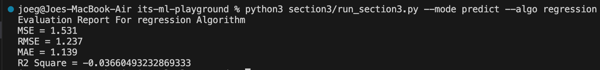
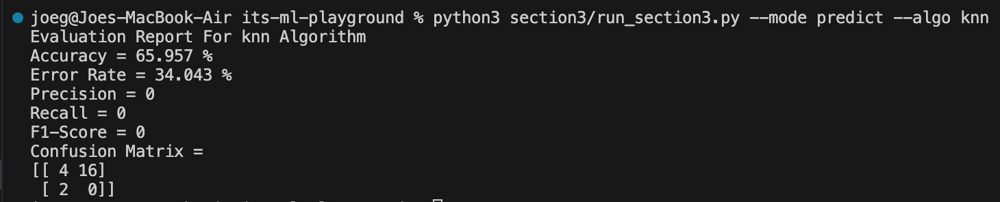
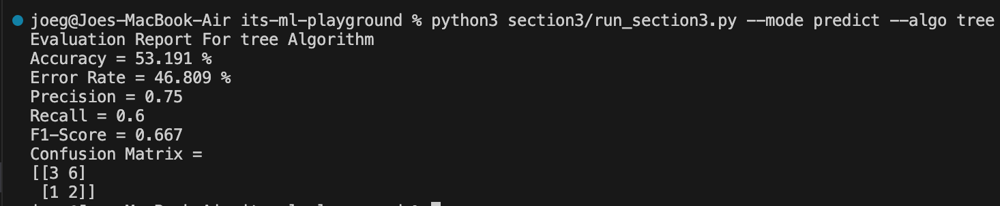
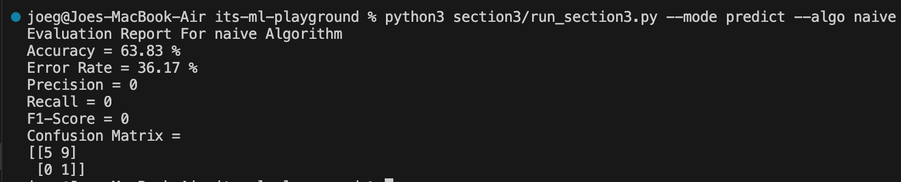
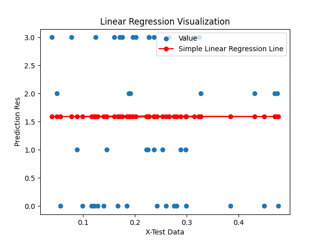
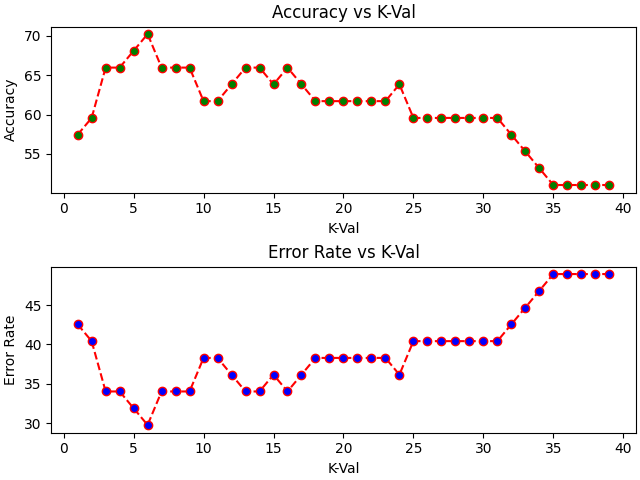
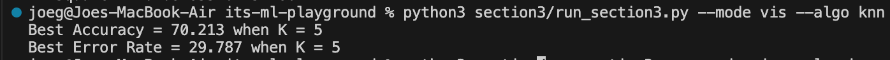
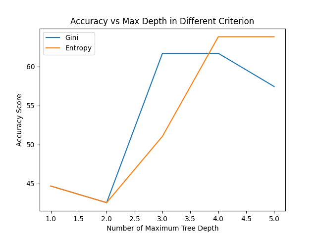

# ✨ Welcome to Section 3 Supervised Learning (Classification) Tutorial ✨

## 📋 Train & Predict Dataset

<details><summary>Simple Linear Regression</summary>

Before start to training and making prediction using Simple Linear Regression, you need to limit features (x_data) of dataset to only 1 feature. Then you can train and make prediction using Simple Linear Regression by running this command in your terminal:

```bash
python3 section3/run_section3.py --algo regression --mode predict
# or
python section3/run_section3.py --algo regression --mode predict
```

In addition, Simple Linear Regression algorithm accept following arguments:

- `--mode` : You can choose between `predict` for training and prediction and `vis` for visualization. **This argument is necessary**
- `--algo` : Name of algorithm used (choose `regression` for Simple Linear Regression). **This argument is necessary**

Running above command will produce regression evaluation metrics score result like this screenshot.



</details>

<details><summary>K-Nearest Neighbor</summary>

To train and predict chosen dataset using K-Nearest Neighbor, you can run this command in your terminal:

```bash
python3 section3/run_section3.py --algo knn --mode predict
# or
python section3/run_section3.py --algo knn --mode predict
```

In addition, K-Nearest Neighbor algorithm accept following arguments:

- `--mode` : You can choose between `predict` for training and prediction and `vis` for visualization. **This argument is necessary**
- `--algo` : Name of algorithm used (choose `knn` for K-Nearest Neighbor). **This argument is necessary**
- `--k_neighbours` : Number of neighbours. Default value is **5**
- `--dist_metric` : Distance measurement method. You can choose between `euclid` for using [Euclidean Distance](https://en.wikipedia.org/wiki/Euclidean_distance), `manhattan` for using [Manhattan Distance](https://en.wikipedia.org/wiki/Taxicab_geometry), or `minkowski` for using [Minkowski Distance](https://en.wikipedia.org/wiki/Minkowski_distance). Default value is **euclid**
- `--p` : P value for Minkowski Distance. Default value is **3**
- `--verbose` : Define to print prediction and predict probability output or not print all of it. Default is **False**

Running above command will produce classification evaluation metrics score result like this screenshot.



*Another Approach: If using Scikit-Learn library, training and prediction with K-Nearest Neighbor will be done by using following code:*

```python
from sklearn.neighbors import KNeighborsClassifier
knn_sk = KNeighborsClassifier(5)
knn_sk.fit(x_train, y_train)
result_sk = knn_sk.predict(x_test)
```

</details>

<details><summary>Decision Tree</summary>

To train and predict chosen dataset using Decision Tree, you can run following command in your terminal:

```bash
python3 section3/run_section3.py --algo tree --mode predict
# or
python section3/run_section3.py --algo tree --mode predict
```

In addition, Decision Tree algorithm accept following arguments:

- `--mode` : You can choose between `predict` for training and prediction and `vis` for visualization. **This argument is necessary**
- `--algo` : Name of algorithm used (choose `tree` for Decision Tree). **This argument is necessary**
- `--criterion` : Choose criterion for training and predict using Decision Tree (choose between `entropy` for using [entropy criterion](https://towardsdatascience.com/entropy-how-decision-trees-make-decisions-2946b9c18c8) and `gini` for using [gini criterion](https://hidir-yesiltepe.medium.com/what-is-gini-impurity-b821dfb63b6e)). Default value is **gini**
- `--max_depth` : Define maximum depth of Decision Tree. Default value is **5**
- `--verbose` : Define to print prediction and predict probability output or not print all of it. Default is **False**

Running above command will produce classification metrics evaluation like this screenshot:



*Another Approach: If using Scikit-Learn library, training and prediction with Decision Tree will be done by using following code:*

```python
from sklearn.tree import DecisionTreeClassifier
dt_sk = DecisionTreeClassifier(random_state=0)
dt_sk.fit(x_train, y_train)
result_sk = dt_sk.predict(x_test)
```

</details>

<details><summary>Naïve Bayes</summary>

To train and predict using Naïve Bayes algorithm, you can run this command in your terminal:

```bash
python3 section3/run_section3.py --algo naive --mode predict
# or
python section3/run_section3.py --algo naive --mode predict
```

In addition, Naïve Bayes algorithm accept following arguments:

- `--mode` : You can choose between `predict` for training and prediction and `vis` for visualization. **This argument is necessary**
- `--algo` : Name of algorithm used (choose `naive` for Naïve Bayes). **This argument is necessary**
- `--verbose` : Define to print prediction and predict probability output or not print all of it. Default is **False**

Running above command will produce classification metrics evaluation like this screenshot:



*Another Approach: If using Scikit-Learn library, training and prediction with Naïve Bayes will be done by using following code:*

```python
from sklearn.naive import GaussianNB
naive_sk = GaussianNB()
naive_sk.fit(x_train, y_train)
result_sk = naive_sk.predict(x_test)
```

</details>

## 🔬 Evaluation Metrics for Supervised Learning Algorithm

We provided 2 types of evaluation metrics in supervised learning algorithm, namely regression metric and classification metric. For regression metrics are explained as below:

- Mean Squared Error (MSE) : To measure of how close the predicted values are to the actual values, with lower values indicating better model performance.
- Root Mean Squared Error (RMSE) : To measures the average difference between values predicted by a model and the actual values. It provides an estimation of how well the model is able to predict the target value (accuracy).
- Mean Average Error (MAE) : To calculates the average magnitude of the absolute errors between the predicted and actual values.
- R2 Score : Also known as Coefficient of Determination, it measures the proportion of the variance in the dependent variable that can be explained by the independent variables in the model.

In addition, for classification metrics are explained as below:

- Accuracy : Measure the proportion of correct predictions made by a classification model over the total number of predictions.
- Error Rate : Measure the proportion of false predictions over the total number of predictions.
- Precision : Measure ability of classification model to correctly identify positive instances
- Recall : Measure ability of classification model to capture all positive instances (capture all true positive and false positive)
- F1-Score : Provide balanced evaluation of classification model's accuracy by considering the result of precision and recall.
- Confusion Matrix : Provide comprehensive review of model divided in true positive, false positive, true negative, and false negative. In this code repository, our confusion matrix constructed with this manner --> `np.array([[true_positive, true_negative], [false_positive, false_negative]])`

## 📊 Visualization

<details><summary>Simple Linear Regression</summary>

In Simple Linear Regression, running visualization command will show Linear Regression result plot with all value represented in scatter. You can run this command to show Linear Regression visualization:

```bash
python3 section3/run_section3.py --algo regression --mode vis
# or
python section3/run_section3.py --algo regression --mode vis
```

Running above command will show Simple Linear Regression visualization like this:



</details>

<details><summary>K-Nearest Neighbor</summary>

In K-Nearest Neighbor, running visualization command will show plot of accuracy result using different k-value and plot of error rate result using different k-value. You can show this plot using following command:

```bash
python3 section3/run_section3.py --algo knn --mode vis
# or
python section3/run_section3.py --algo knn --mode vis
```

Running above command will show K-Nearest Neighbor visualization like this:





</details>

<details><summary>Decision Tree</summary>

In Decision Tree algorithm, running visualization command will show the difference between using gini impurity criterion and entropy criterion compared to its maximum depth of Decision Tree and its accuracy score. Tou can show this plot by running this command:

```bash
python3 section3/run_section3.py --algo tree --mode vis
# or
python section3/run_section3.py --algo tree --mode vis
```

Running above command will show Decision Tree visualization like this:



</details>

## ❗ Important: Test Your Understanding for Section 3: Supervised Learning (Classification)

You can test your understanding about Section 3: Supervised Learning (Classification) by answer all questions in `practice_section3.ipynb`. Follow all guides from each cell. You can also compare your result by expanding solution below code cell.
