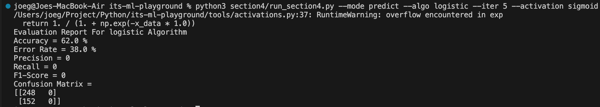
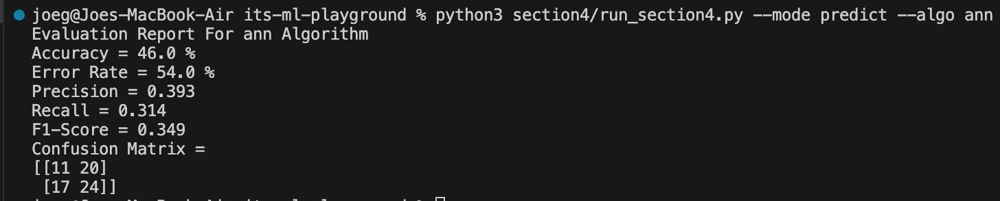
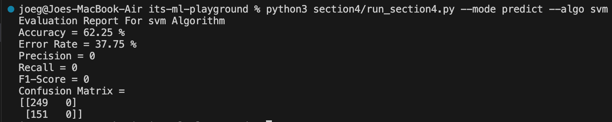
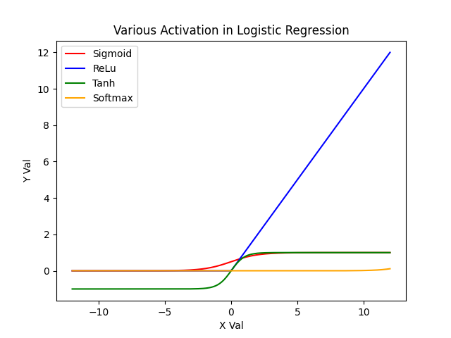
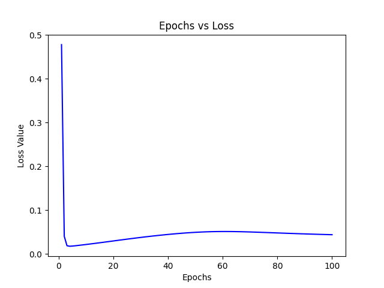
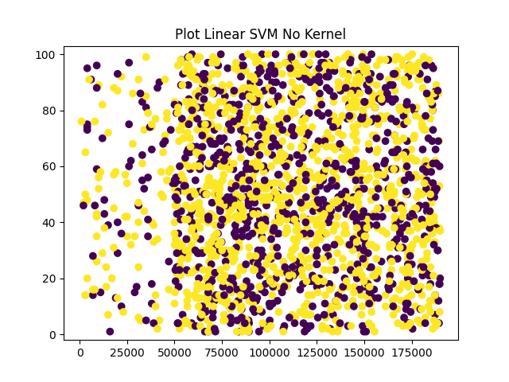

# ✨ Welcome to Section 4 Supervised Learning Function Based Tutorial ✨

## 📋 Train & Predict Dataset

<details><summary>Logistic Regression</summary>

To train and predict using Logistic Regression, you need to run following command in your terminal:

```bash
python3 section4/run_section4.py --mode predict --algo logistic
# or
python section4/run_section4.py --mode predict --algo logistic
```

This command accept following arguments:

- `--mode` : You can choose between `predict` for training and prediction and `vis` for visualization. **This argument is necessary**
- `--algo` : Name of algorithm used (choose `logistic` for Logistic Regression). **This argument is necessary**
- `--learning_rate` : Learning rate value in Logistic Regression. Default value is **0.01**
- `--iter` : Define number of epochs. Default value is **100**
- `--threshold` : Define number of threshold value for filter prediction results. Default value is **0.5**
- `--epsilon` : Value of error threshold for compute cost function to prevent divide by zero value. Default value is **1e-8**
- `--activation` : Define activation algorithm for train and predict (choose between `sigmoid`, `relu`, `tanh`, and `softmax`). Default value is **sigmoid**
- `--verbose` : Decide to print debug value or not. Default value is **False**

Running above command will produce result below:



*Another Approach: If using Scikit-Learn library, training and prediction with Decision Tree will be done by using following code:*

```python
from sklearn.linear_model import LogisticRegression
lr_sk = LogisticRegression()
lr_sk.fit(x_train, y_train)
result_sk = lr_sk.predict(x_test)
```

</details>

<details><summary>Artificial Neural Network</summary>

To train and predict Artificial Neural Network, you can run following command in your terminal:

```bash
python3 section4/run_section4.py --mode predict --algo ann
# or
python section4/run_section4.py --mode predict --algo ann
```

This command accept following arguments:

- `--mode` : You can choose between `predict` for training and prediction and `vis` for visualization. **This argument is necessary**
- `--algo` : Name of algorithm used (choose `ann` for Artificial Neural Network). **This argument is necessary**
- `--learning_rate` : Learning rate value in Artificial Neural Network. Default value is **0.01**
- `--hidden_layer` : Define number of hidden layer between input layer and output layer. Default value is **10**
- `--iter` : Define number of epochs. Default value is **100**
- `--activation` : Define activation algorithm for train and predict (choose between `sigmoid`, `relu`, `tanh`, and `softmax`). Default value is **sigmoid**
- `--verbose` : Decide to print debug value or not. Default value is **False**

Running above command will produce result below:



*Another Approach: If using Scikit-Learn library, training and prediction with Artificial Neural Network will be done by using following code:*

```python
from sklearn.neural_network import MLPClassifier
ann_sk = MLPClassifier()
ann_sk.fit(x_train, y_train)
result_sk = ann_sk.predict(x_test)
```

</details>

<details><summary>Support Vector Machine</summary>

To train and predict using Support Vector Machine, you can run this command in your terminal:

```bash
python3 section4/run_section4.py --mode predict --algo svm
# or
python section4/run_section4.py --mode predict --algo svm
```

This command accept following arguments:

- `--mode` : You can choose between `predict` for training and prediction and `vis` for visualization. **This argument is necessary**
- `--algo` : Name of algorithm used (choose `svm` for Support Vector Machine). **This argument is necessary**
- `--learning_rate` : Learning rate value in Support Vector Machine. Default value is **0.01**
- `--iter` : Define number of epochs. Default value is **100**
- `--regularization` : Define regularization coefficient for Support Vector Machine. Default value is **0.01**

Running above command will produce result below:



*Another Approach: If using Scikit-Learn library, training and prediction with Support Vector Machine will be done by using following code:*

```python
from sklearn.svm import SVC
svm_sk = SVC()
svm_sk.fit(x_train, y_train)
result_sk = svm_sk.predict(x_test)
```

</details>

## 🔬 Evaluate Metrics

We use same evaluation metrics like in section 3: Supervised Learning. Please refer to **Section 3 README.md**

## 📊 Visualization

<details><summary>Logistic Regression</summary>

In Logistic Regression, running visualization command will show a plot of various activation can be used in Logistic Regression. To show this plot, you can run this command in your terminal:

```bash
python3 section4/run_section4.py --mode vis --algo logistic
# or
python section4/run_section4.py --mode vis --algo logistic
```

Running above command will show Artificial Neural Network visualization below:



</details>

<details><summary>Artificial Neural Network</summary>

In Artificial Neural Network, running visualization command will show a plot of loss value in every epoch. To show this plot, you can run this command below in your terminal:

```bash
python3 section4/run_section4.py --mode vis --algo ann
# or
python section4/run_section4.py --mode vis --algo ann
```

Running above command will show Artificial Neural Network visualization below:



</details>

<details><summary>Support Vector Machine</summary>

In Support Vector Machine, running visualization command will show a plot of each prediction from testing data. To show this plot, you can run following command below:

```bash
python3 section4/run_section4.py --mode vis --algo svm
# or
python section4/run_section4.py --mode vis --algo svm
```

Running above command will show Support Vector Machine visualization below:



</details>

## ❗ Important: Test Your Understanding for Section 4: Supervised Learning Function Based

You can test your understanding about Section 4: Supervised Learning Function Based by answer all questions in `practice_section4.ipynb`. Follow all guides from each cell. You can also compare your result by expanding solution below code cell.
