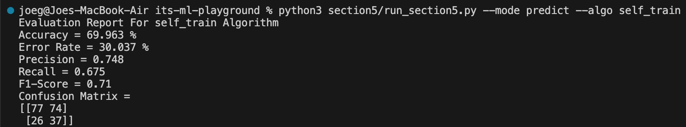
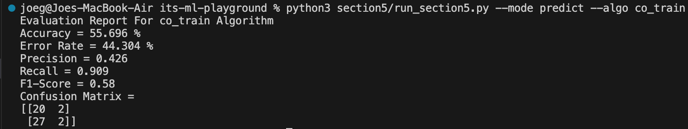
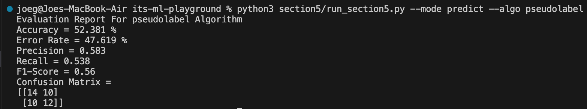

# ✨ Welcome to Section 5 Semi-Supervised Learning Tutorial ✨

## 📋 Training & Predict

<details><summary>Self Training Classifier</summary>

To start training and prediction process using Self Training Classifier, you can run below command:

```bash
python3 section5/run_section5.py --mode predict --algo self_train
# or
python section5/run_section5.py --mode predict --algo self_train
```

Running that command will show below output:



*Important Note: for classifier of Self Training Classfier, we use our from scratch K-Nearest Neighbor Classifier which this classifier has predict_proba function to print output of each class probability.*

</details>

<details><summary>Co Training Classifier</summary>

To start training and prediction process using Co Training Classifier, you can run below command:

```bash
python3 section5/run_section5.py --mode predict --algo co_train
# or
python section5/run_section5.py --mode predict --algo co_train
```

Running that command will show below output:



*Important Note: for classifier of Co Training Classfier, we use our from scratch K-Nearest Neighbor Classifier for both classifier which this classifier has predict_proba function to print output of each class probability.*

</details>

<details><summary>Pseudolabelling</summary>

To start training and prediction process using Pseudolabelling, you can run below command:

```bash
python3 section5/run_section5.py --mode predict --algo pseudolabel
# or
python section5/run_section5.py --mode predict --algo pseudolabel
```

Running that command will show below output:



*Important Note: for classifier of Pseudolabelling, we use our from scratch K-Nearest Neighbor Classifier which this classifier has predict_proba function to print output of each class probability.*

</details>

## 🔬 Evaluation Metrics Semi-Supervised Learning

We use same evaluation metrics like in section 3: Supervised Learning. Please refer to **Section 3 README.md**

## ❗ Important: Test Your Understanding for Section 5: Semi-Supervised Learning

You can test your understanding about Section 5: Semi-Supervised Learning by answer all questions in `practice_section5.ipynb`. Follow all guides from each cell. You can also compare your result by expanding solution below code cell.
